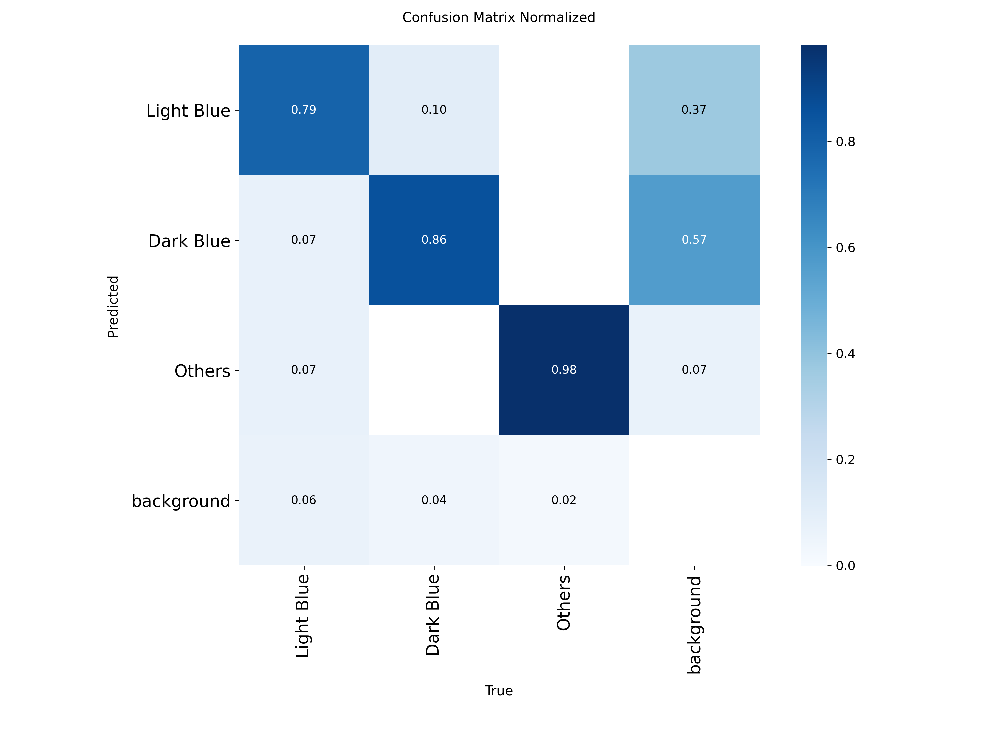
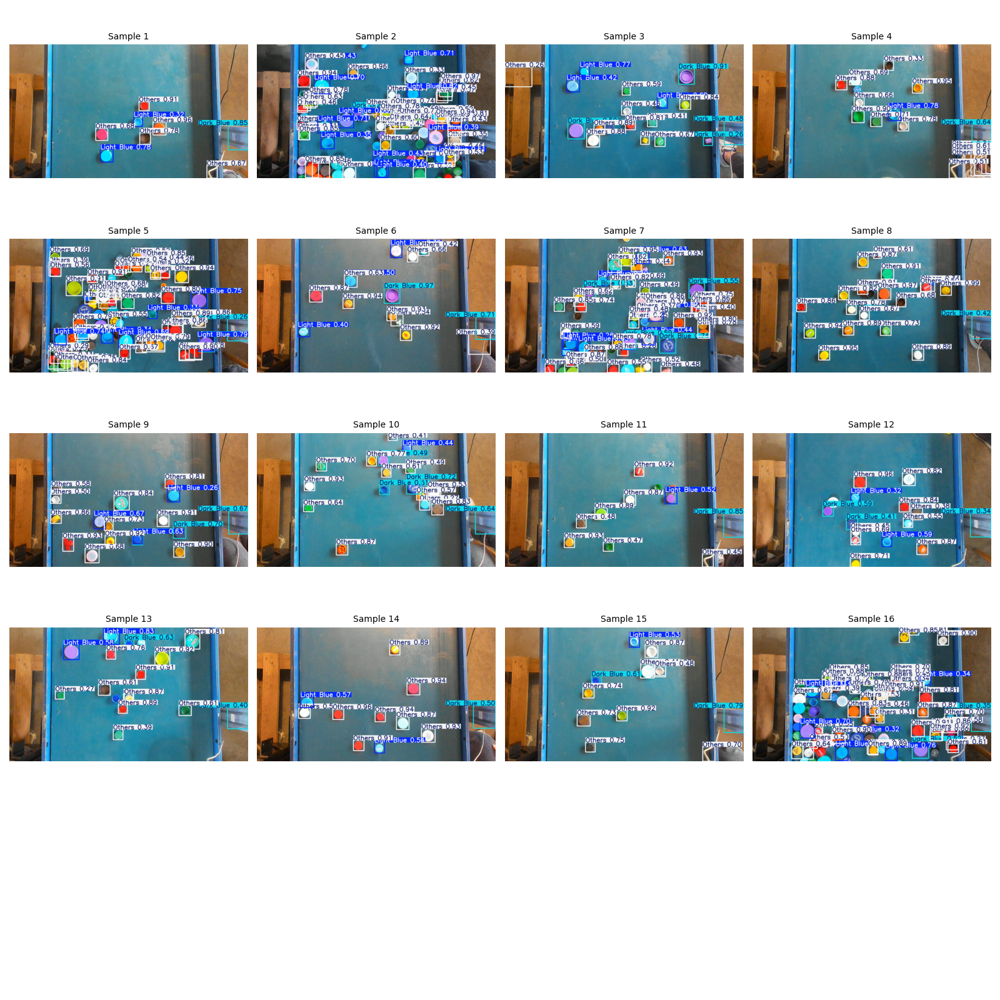

# Bottle Cap Defect Detection 🧢


End-to-end Machine Learning pipeline to detect and classify bottle caps (**Light Blue**, **Dark Blue**, **Others**) on edge devices (Raspberry Pi 5) with <10ms inference time target.

## 📌 Project Overview
* **Problem:** Detect bottle caps with specific color variations (Light vs Dark Blue) under noisy labels (original dataset labeled all as class 0).
* **Solution:** * **Data Engineering:** Semi-automatic relabeling using HSV thresholding & Albumentations for robust data augmentation.
    * **Model:** YOLOv8 Nano (Optimized for Edge Deployment).
    * **Results:** mAP50: **96.7%**, Inference Time: **~50-70ms (CPU)** / **<10ms (Target NPU/GPU)**.

## 📊 Model Performance
The model was trained using **YOLOv8n** for **20 epochs** on an augmented dataset.

| Class        | Images | Instances | Precision | Recall | mAP50 | mAP50-95 |
|--------------|--------|-----------|-----------|--------|-------|-----------|
| **All** | 51     | 339       | 0.984     | 0.925  | 0.967 | 0.803     |
| Light Blue   | 15     | 95        | 0.988     | 0.863  | 0.943 | 0.826     |
| Dark Blue    | 14     | 78        | 0.971     | 0.936  | 0.974 | 0.738     |
| Others       | 22     | 166       | 0.994     | 0.977  | 0.985 | 0.845     |

### Confusion Matrix
The model shows strong separation between "Others" and Blue variants.


## The Robustness Test
The model is showing strong generalization ability when evaluated the Kaggle Dataset (https://www.google.com/url?q=https%3A%2F%2Fwww.kaggle.com%2Fdatasets%2Fartemsmetanin%2Fcolor-cap) containing bottle caps placed on a white background, which is significantly different from the green-tray background used during training. Despite this domain shift or changing the background, the model successfully detected most caps across samples, indicating that it's good at learning features transfer well beyond the training environment. However, the confidence scores dropped noticeably due to background color distribution mismatch, revealing limitation in robustness under unseen visual conditions. I think to improve production readiness, applying background augmentation such as copy-pasting caps onto diverse random surfaces might help the model better handle varying environments and maintain high confidence across domains. 


## 🛠️ Installation

1. **Clone the repository**
   ```bash
   git clone [https://github.com/CiaThing/Bottle_Cap_Detection_ML_Engineer_Test.git](https://github.com/CiaThing/Bottle_Cap_Detection_ML_Engineer_Test.git)
   cd Bottle_Cap_Detection_ML_Engineer_Test

2. **Install Dependencies (Python 3.10 Recommended)**
```bash
pip install ultralytics opencv-python pyyaml
```

🚀 Usage (CLI)
This project includes a custom CLI tool called bsort to handle training and inference easily.

1. Run Inference (Detection) To detect bottle caps on a new image:

```Bash

python -m bsort.main infer --config settings.yaml --image dataset_test/test/sample_image.jpg
```
2. Train Model (Reproduce Results) To retrain the model from scratch (requires dataset):

```Bash
python -m bsort.main train --config settings.yaml
```

🐳 Docker (Optional)
Build and run the environment using Docker to ensure consistency and reproducibility.
```
Bash

# Build Image
docker build -t bsort .
```
# Run Inference inside Docker
# (Using -v to mount current directory so docker can access your images)
docker run -v $(pwd):/app bsort infer --config settings.yaml --image sample.jpg
📂 Project Structure
.
├── .github/workflows/  # CI/CD Configuration (GitHub Actions)
├── bsort/              # Source Code for CLI tool
│   ├── __init__.py
│   └── main.py         # Main program script
├── models/             # Trained models & Evaluation plots
│   ├── best.pt         # Best YOLOv8n weights
│   └── ...             # Evaluation images
├── tests/              # Unit tests
├── notebooks/          # Experimentation & Analysis (Task 1)
├── dataset_test/       # (Local Only) Test images for inference
├── Dockerfile          # Docker configuration
├── settings.yaml       # Hyperparameters configuration
└── README.md           # Project Documentation